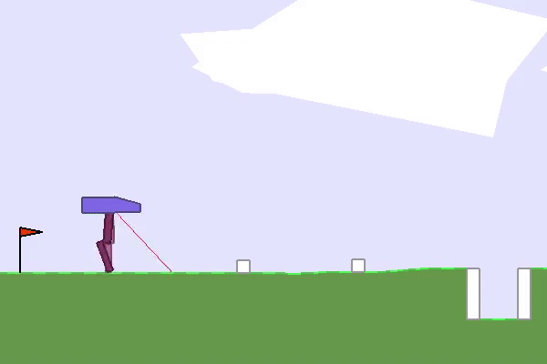

# RL-Baselines
A repo to house my reliable Reinforcement Algorithms
- Reinforcement Learning

# Random Agent

List of Algorithms:
- Rainbow
  - Q Table
  - DQN
  - Double DQN
  - Dueling DQN
  - PER
  - Noisy Net
  - Multi Step
  - Rainbow 
- Policy
  - REINFORCE
  - VPG
  - Actor Critic
  
